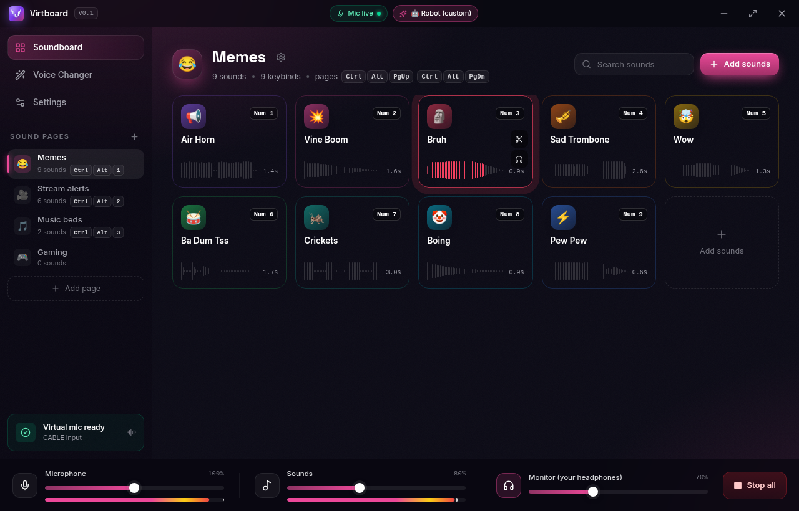
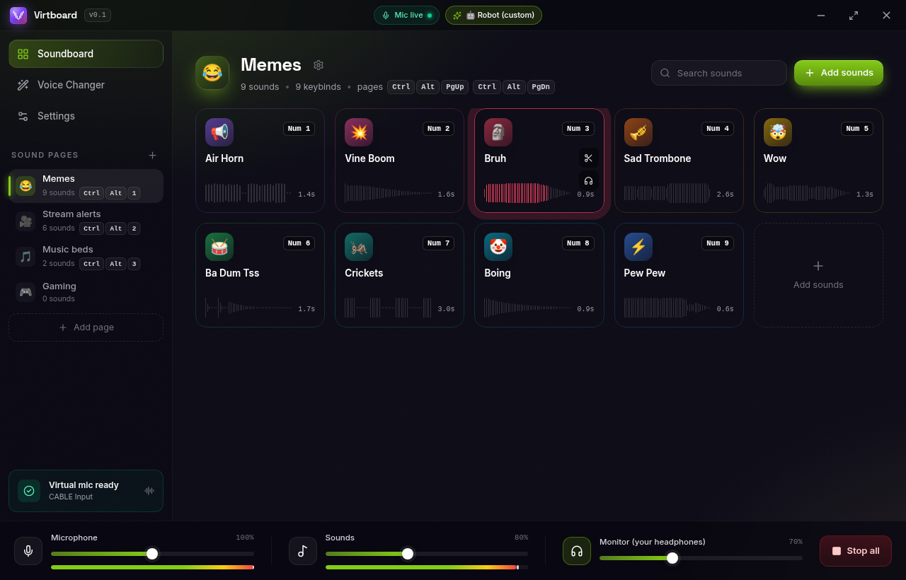
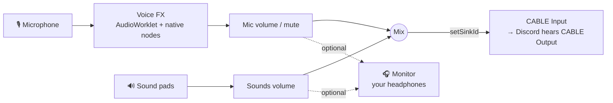

<p align="center">
  
</p>

<p align="center">
  <b>A fast, beautiful soundboard & real-time voice changer for Windows.</b><br/>
  Plays your sounds and your (changed) voice straight into Discord, games and OBS through a virtual microphone.
</p>

<p align="center">
  <a href="https://github.com/scopeddlol/virtboard/releases/latest"></a>
  
  
</p>

<p align="center">
  
</p>

---

## ✨ Features

| | |
|---|---|
| 🎛️ **Unlimited sounds** | Drag & drop any MP3, WAV, OGG, FLAC, M4A, AAC, WEBM or OPUS file — as many as you like. |
| ⌨️ **Global keybinds** | Every sound can have a system-wide hotkey that works even when Virtboard is minimized to the tray. Numpad keys, F-keys, media keys and combos are all supported. |
| 📑 **Pages of sounds** | Each page has its **own keybind layout** — `Num 1` can be an air horn on *Memes* and a follower alert on *Stream*. Switch pages with a hotkey. |
| 🎙️ **Voice changer** | 13 built-in voices (Deep, Chipmunk, Robot, Radio, Demon, Alien, 8-Bit, Ghost…) plus a full preset editor: pitch, robot, bit-crush, distortion, tremolo, filters, 3-band EQ, echo, reverb, noise gate. |
| ✂️ **Sound trimmer** | Waveform editor with a draggable trim region, fine nudging, fades, volume, speed, loop and play-mode — then export the result as WAV. |
| 🔌 **Virtual microphone** | Mic + sounds are mixed and sent to [VB-Audio Virtual Cable](https://vb-audio.com/Cable/). Virtboard detects it automatically and can install it for you. |
| 🎧 **Optional monitoring** | Choose whether *you* hear the sounds (and/or your changed voice) on your headphones — globally or per sound. |
| 🎚️ **Mixer** | Separate volume sliders & live meters for microphone, sounds and monitor, plus a one-click mute. |
| 🪟 **Custom window chrome** | Frameless window with its own minimize / fullscreen / exit bar. |
| 🧷 **Tray mode** | Close to tray, launch on startup, and control mic, voices and pages from the tray menu. |
| 🎨 **Themes** | Six accent colours: Violet, Magenta, Ocean, Lime, Sunset, Rose. |
| 📦 **Custom installer** | Branded NSIS installer that can set up the virtual cable for you. |

## 📥 Install

1. Download **`Virtboard-Setup-x.y.z.exe`** from the [latest release](https://github.com/scopeddlol/virtboard/releases/latest).
2. Run it. When asked, let it install **VB-Audio Virtual Cable** (free). This is the driver that creates the virtual microphone. Reboot if the driver installer asks you to.
3. In **Discord** → *Settings → Voice & Video* → **Input Device**, choose **`CABLE Output (VB-Audio Virtual Cable)`**. In OBS, games, Zoom etc. pick the same device as your microphone.
4. Open Virtboard → **Settings** and make sure *Virtual mic output* is **`CABLE Input`** and *Microphone input* is your real mic.

That's it: everyone now hears your voice (with effects, if enabled) plus your sounds.

> **Why a separate driver?** Windows only lets signed kernel drivers create new audio devices. VB-CABLE is the long-standing, free standard for this. Virtboard never bundles it; it downloads the official package from vb-audio.com on request.

## 📸 Screenshots

### Soundboard

<table>
  <tr>
    <td></td>
    <td></td>
  </tr>
  <tr>
    <td align="center"><sub>Sound pads with live waveform progress & per-page keybinds</sub></td>
    <td align="center"><sub>Every page has its own keybind layout</sub></td>
  </tr>
  <tr>
    <td></td>
    <td></td>
  </tr>
  <tr>
    <td align="center"><sub>Hover a pad for quick trim & headphone preview</sub></td>
    <td align="center"><sub>Right-click: preview locally, edit, copy / move to page, delete</sub></td>
  </tr>
  <tr>
    <td></td>
    <td></td>
  </tr>
  <tr>
    <td align="center"><sub>Rename pages, pick an emoji, give each page a jump hotkey</sub></td>
    <td align="center"><sub>Drag audio files anywhere onto the window to add them</sub></td>
  </tr>
</table>

### Sound trimmer

<p align="center"></p>
<p align="center"><sub>Drag the region to trim, nudge start/end precisely, add fades, change speed, set the keybind & play mode, export as WAV.</sub></p>

### Voice changer

<table>
  <tr>
    <td></td>
    <td></td>
  </tr>
  <tr>
    <td align="center"><sub>One-click voices with a live spectrum of your mic</sub></td>
    <td align="center"><sub>Build your own presets; every change applies live</sub></td>
  </tr>
</table>

### Settings

<table>
  <tr>
    <td></td>
    <td></td>
  </tr>
  <tr>
    <td align="center"><sub>Audio routing at a glance, with VB-CABLE detection</sub></td>
    <td align="center"><sub>Pick input, virtual output and monitor devices</sub></td>
  </tr>
  <tr>
    <td></td>
    <td></td>
  </tr>
  <tr>
    <td align="center"><sub>Rebind every global hotkey; conflicts are flagged</sub></td>
    <td align="center"><sub>Tray behavior, launch on startup & accent colours</sub></td>
  </tr>
</table>

### Themes & first run

<table>
  <tr>
    <td></td>
    <td></td>
  </tr>
  <tr>
    <td align="center"><sub>Magenta accent</sub></td>
    <td align="center"><sub>Lime accent</sub></td>
  </tr>
</table>
<p align="center"></p>
<p align="center"><sub>First-run guide</sub></p>

### Installer

<table>
  <tr>
    <td></td>
    <td></td>
    <td></td>
  </tr>
  <tr>
    <td></td>
    <td></td>
    <td></td>
  </tr>
</table>
<p align="center"><sub>Branded NSIS installer: custom artwork, per-user or all-users install, optional VB-CABLE setup, Discord tip on finish.</sub></p>

> Screenshots are captured automatically from the real app (`scripts/screenshots.mjs`, `scripts/installer-screens.sh`) on Linux, so the audio device names shown are simulated.

## ⌨️ Default hotkeys

| Action | Default |
|---|---|
| Stop all sounds | `Ctrl` `Alt` `End` |
| Mute / unmute microphone | `Ctrl` `Alt` `M` |
| Toggle voice changer | `Ctrl` `Alt` `V` |
| Next / previous sound page | `Ctrl` `Alt` `PgDn` / `PgUp` |
| Show / hide Virtboard | `Ctrl` `Alt` `B` |

Sound keybinds are set per sound (and per page) in the trimmer. Voice presets and pages can have their own hotkeys too.
**Tip:** the numpad (`Num 0`–`Num 9`, `Num +`, …) is perfect for sounds. Unlike letter keys it won't block typing.

## 🧠 How it works



* **Electron main process**: frameless window, tray, global shortcuts (only the *active page's* sound keys are registered, so the same key can mean different things per page), atomic JSON storage, VB-CABLE installer.
* **Renderer**: React UI + a Web Audio graph running in Chromium's real-time audio thread. The voice changer is a custom `AudioWorklet` (noise gate → pitch shifter → ring-mod → bit-crusher → tremolo) followed by native filters, EQ, wave-shaper, delay and convolution reverb. When the voice changer is off, the worklet is disconnected entirely (zero DSP cost).
* **Two audio contexts** so the mix can go to the virtual cable while the monitor goes to your headphones.
* Trims are **non-destructive**; your original files are never modified.

Everything is stored in `%APPDATA%\Virtboard` (`state.json` + a `sounds` folder).

## 🧩 Built with these open-source projects

* [Electron](https://www.electronjs.org/) · [React](https://react.dev/) · [Vite](https://vite.dev/) · [TypeScript](https://www.typescriptlang.org/)
* [Tailwind CSS](https://tailwindcss.com/): styling
* [Radix UI](https://www.radix-ui.com/): accessible sliders, switches, selects, dialogs, menus, tooltips
* [Motion](https://motion.dev/): animations & layout transitions
* [wavesurfer.js](https://wavesurfer.xyz/) + Regions plugin: the waveform trimmer
* [Lucide](https://lucide.dev/): icons
* [Sonner](https://sonner.emilkowal.ski/): toasts
* [Zustand](https://zustand.docs.pmnd.rs/): state
* [Inter](https://rsms.me/inter/) & [Space Grotesk](https://fonts.google.com/specimen/Space+Grotesk) via Fontsource
* [electron-builder](https://www.electron.build/) + [NSIS](https://nsis.sourceforge.io/): the installer

## 🛠️ Build from source

```bash
git clone https://github.com/scopeddlol/virtboard
cd virtboard
npm install
npm run dev        # hot-reloading dev app
npm run dist:win   # → release/Virtboard-Setup-x.y.z.exe
```

Other scripts:

| Script | What it does |
|---|---|
| `npm run typecheck` | TypeScript checks |
| `npm run icons` | Regenerates the logo, `.ico`, tray icons and installer artwork from `scripts/logo.mjs` |
| `node scripts/smoke-test.mjs` | End-to-end test of the real app (hotkeys, pages, playback, persistence, pitch-shift DSP) |
| `node scripts/screenshots.mjs` | Re-captures the README screenshots |

Releases are built on `windows-latest` by GitHub Actions whenever a `v*` tag is pushed (`.github/workflows/release.yml`).

## ❓ FAQ

**My friends can't hear my sounds.** Check that Discord's *Input Device* is `CABLE Output` and Virtboard's *Virtual mic output* is `CABLE Input`. Turn off Discord's *Noise Suppression (Krisp)*, which can filter out sound effects.

**I hear an echo of myself.** Turn off *Hear my voice* in Settings (or the ear toggle on the Voice Changer page).

**A hotkey doesn't work.** Another app may already own that shortcut; Virtboard marks it with a ⚠️. Pick a different combo.

**Does it work without VB-CABLE?** Yes, as a local soundboard / voice monitor. Other apps just won't receive the mix.

## 📄 License

[MIT](LICENSE) © scopeddlol. VB-Audio Virtual Cable is © VB-Audio Software and is downloaded from its official site. It is not distributed with Virtboard.
